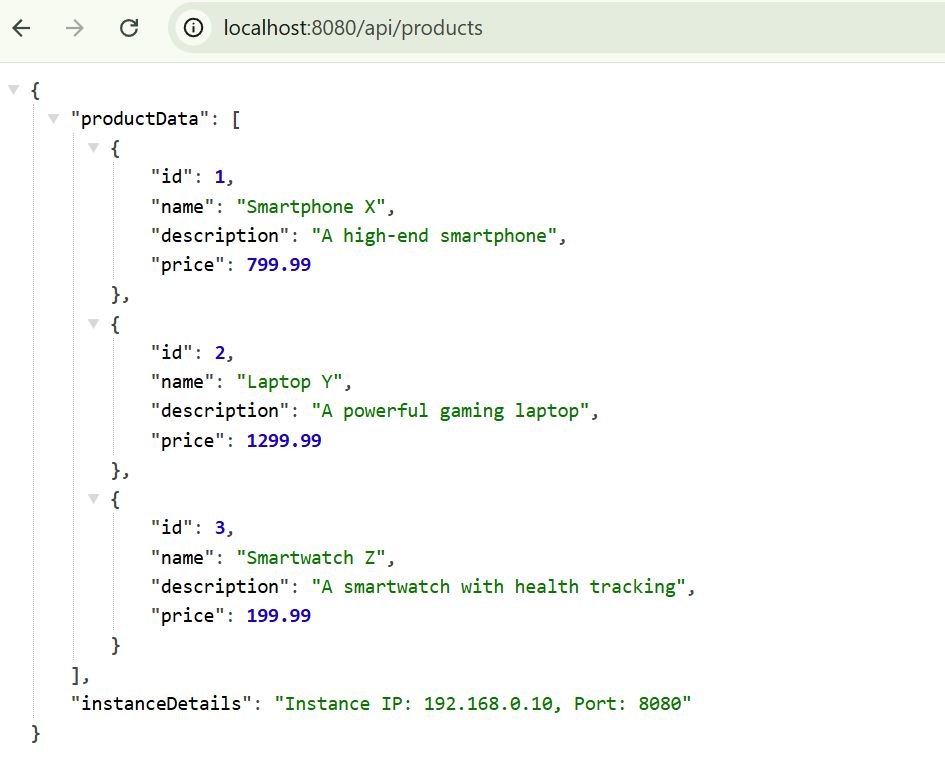

# online-shopping-demo
This demo app was created to demonstrate the process of migrating an on-prem REST API to the AWS cloud during online webinar.

## 🛠️ Build and Run

### Prerequisites
- Java 17 or later
- Maven 3.6+

### Build the Application
This command will compile the source code and package the application into a JAR file under the target/ directory.
```bash

mvn clean package
```

### Run the Application
Option 1. Using the JAR File 
```bash

java -jar target/online-shopping-0.0.1-SNAPSHOT.jar
```
Option 2. Using Maven
```bash

mvn spring-boot:run
```
### How to Call API ?
Call the REST endpoint using API client (browser or Postman)
```
http://localhost:8080/api/products
```
Response:
